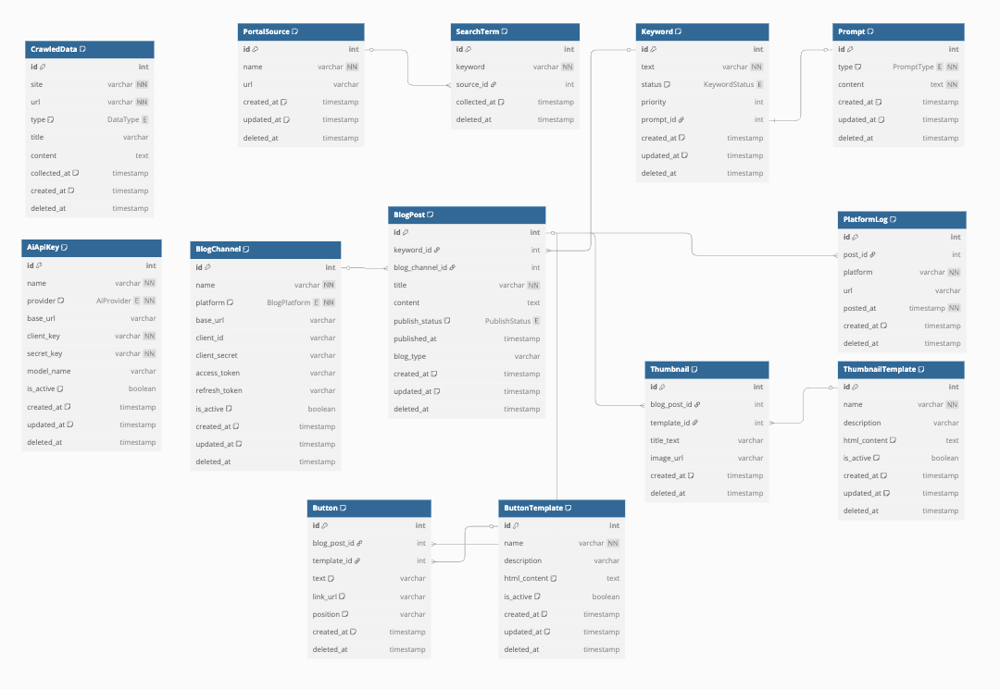

# Bulbak 프로젝트 소개서

AI 기반 자동화 블로그 콘텐츠 퍼블리싱 시스템

---

## 1. 개요

**Bulbak**은 다양한 포털에서 실시간 검색어를 수집하여 유효 키워드를 선정하고, AI(GPT 등)를 이용해 블로그 콘텐츠를 자동 생성한 뒤, 썸네일/버튼과 함께 블로그 및 SNS에 자동 게시하는 통합 자동화 시스템입니다.

시스템은 크롤링, AI 처리, 디자인 템플릿 처리, 자동 배포까지 일련의 프로세스를 자동화함으로써 **운영자가 개입하지 않고도 수익형 콘텐츠를 지속적으로 생산**할 수 있도록 설계되었습니다.

## n8n 으로 진행해보다 구글시트를 이용해서 데이터 처리를 진행하다가 하두 복잡하고 불편해서 그냥 개발 하기로 했습니다.

## 2. 주요 기능

### 2.1 검색어 수집 및 키워드 선정

- 줌, 네이버, 다음 등의 포털에서 실시간 인기 검색어 수집 (15분 / 30분 / 60분 주기)
- 반복 등장 및 우선순위 분석을 통해 자동으로 유효 키워드 선별

### 2.2 콘텐츠 생성 (GPT 기반)

- GPT 및 기타 AI API를 이용한 블로그 글 자동 작성
- 글 유형에 따른 프롬프트 템플릿 시스템 운영

### 2.3 시각 요소 자동화

- 썸네일: HTML/CSS 기반 템플릿 → 이미지 생성 → S3 업로드
- 버튼: CTA 역할의 링크 버튼 생성, 템플릿 기반 시각 스타일 지원

### 2.4 자동 게시 시스템

- 블로그 자동 포스팅 (Blogger, Tistory, WordPress 등)
- 게시 상태 추적 및 실패 시 재시도 가능
- SNS(Threads, X, Instagram 등)에도 자동 요약 업로드 가능

### 2.5 관리자 기능 (향후)

- 웹 기반 관리자 UI에서 상태 모니터링, 수동 승인, 수익 조회 등 지원 예정

---

## 3. 기술 스택

| 구성요소      | 기술                                      |
| ------------- | ----------------------------------------- |
| 백엔드        | NestJS + Prisma                           |
| DB            | PostgreSQL (로컬) + pgvector (예정)       |
| 파일 스토리지 | AWS S3 (썸네일 이미지 업로드)             |
| AI 통합       | OpenAI GPT, Gemini, Grok 등               |
| 배포 대상     | Blogger, WordPress, Threads, Instagram 등 |
| 자동화 툴     | 크론 스케줄러, n8n 연동 예정              |

---

## 4. 시스템 로직 요약

- 실시간 검색어와 크롤링 데이터를 주기적으로 저장 (1분)
- 1시간마다 자동으로 `SearchTerm`과 `CrawledData`를 통합 분석하여 유사 키워드를 그룹핑
- 전처리(normalize) 및 중복 필터링 후 대표 키워드 생성
- `SearchTermKeywordLink` 및 `CrawledDataKeywordLink` 테이블로 키워드 생성 원본 연결
- AI API는 제목과 본문을 생성할 때만 사용
- 비용 최적화를 위해 GPT 호출은 글 생성 시점에서만 수행하며, 추출된 키워드는 단순 로직으로 처리

---

## 5. DB 구조 요약

> 자세한 Prisma 모델은 `prisma/schema.prisma`를 참조



### 🔹 주요 테이블

- `PortalSource`: 검색어 수집 출처
- `SearchTerm`: 원본 실시간 검색어 로그
- `Keyword`: 최종 선정된 유효 키워드
- `SearchTermKeywordLink`: 어떤 검색어가 어떤 키워드를 유도했는지 연결
- `CrawledData`: 기사/채용 등 외부 데이터 크롤링 결과
- `CrawledDataKeywordLink`: 어떤 크롤링 데이터가 어떤 키워드와 연관됐는지 추적
- `Prompt`: 콘텐츠 유형별 GPT 프롬프트
- `BlogPost`: 생성된 블로그 글 및 게시 상태
- `BlogChannel`: 블로그 플랫폼별 인증 정보 및 포스팅 대상
- `PlatformLog`: 외부 SNS 플랫폼 게시 기록
- `ThumbnailTemplate` / `Thumbnail`: 썸네일 템플릿 및 인스턴스
- `ButtonTemplate` / `Button`: 버튼 템플릿 및 인스턴스
- `AiApiKey`: AI API 키 관리 (여러 플랫폼 지원)

---

## 6. 초기 실행 가이드

### 6.1 NestJS 프로젝트 설치

```bash
pnpm install
```

### 6.2 Prisma DB 마이그레이션 적용

```bash
pnpm prisma migrate dev --name init
```

### 6.3 Prisma Client 생성 (필요 시)

```bash
pnpm prisma generate
```

### 6.4 기본 데이터 시드 실행

```bash
pnpm tsx prisma/seed.ts
```

또는

```bash
pnpm prisma db seed
```

---

## 7. 향후 개발 계획

- [x] Python 기반 크롤러 서버 연동
- [x] 키워드 자동 생성 로직 설계 (1시간 단위)
- [x] SearchTerm / CrawledData 기반 다대다 연결 테이블 구성
- [ ] pgvector 확장을 통한 의미 유사 키워드 비교 로직 구현
- [ ] 관리자 UI 웹 대시보드 구축
- [ ] SaaS 혹은 상용 서비스화 고려 (유료화 모델 검토 포함)

---

## 8. AI 사용 전략 및 키워드 생성 철학

### 🔍 키워드 vs. 콘텐츠 생성 분리 전략

- **키워드는 전처리 기반 유사 키워드 매칭으로 생성**

  - PostgreSQL의 LIKE, ILIKE, Levenshtein 등 텍스트 기반 비교 활용
  - 비용 없이 빠르게 중복 제거 및 대표 키워드 생성 가능
  - 추후 `pgvector` 등 임베딩 확장 고려 가능

- **제목과 본문은 AI를 통해 생성**
  - GPT, Claude, DeepSeek, Gemini 등 사용 가능
  - 프롬프트 기반 구조로 다양한 글 유형 지원
  - 비용 부담이 있기 때문에 **글 작성 시점에만 호출**하여 효율성 확보

### 💡 실제 활용 예시: "황희찬"

```
검색어:
- 황희찬 출전
- 황희찬 부상 소식
- 황희찬 인터뷰

→ 키워드: "황희찬"
→ GPT 생성 제목 예시:
- "황희찬 최근 부상 소식과 복귀 전망"
- "황희찬 인터뷰 정리: 훈련 루틴과 목표"
```

### 📊 로직 흐름 요약

1. `SearchTerm`, `CrawledData` 1분 단위 수집
2. 1시간 단위 집계 후:
   - normalize + 유사어 그룹핑
   - 대표 키워드 생성 (Keyword)
   - `SearchTermKeywordLink`, `CrawledDataKeywordLink` 연결
3. 선택된 키워드 → GPT 호출로 제목/본문 생성
4. `BlogPost` 저장 후 블로그/SNS 업로드

---

## 9. 부록: 프로젝트 목표 요약

> "키워드 수집부터 콘텐츠 제작, 이미지화, 포스팅, 외부 채널 공유까지.  
> 사람이 개입하지 않아도 콘텐츠는 흘러간다. 그게 바로 Bulbak의 철학이다."

---

📦 시스템 준비는 끝났습니다.  
이제부터는 진짜 자동화 퍼블리싱의 시대입니다. 함께 개발, 출발합니다. 🚀
